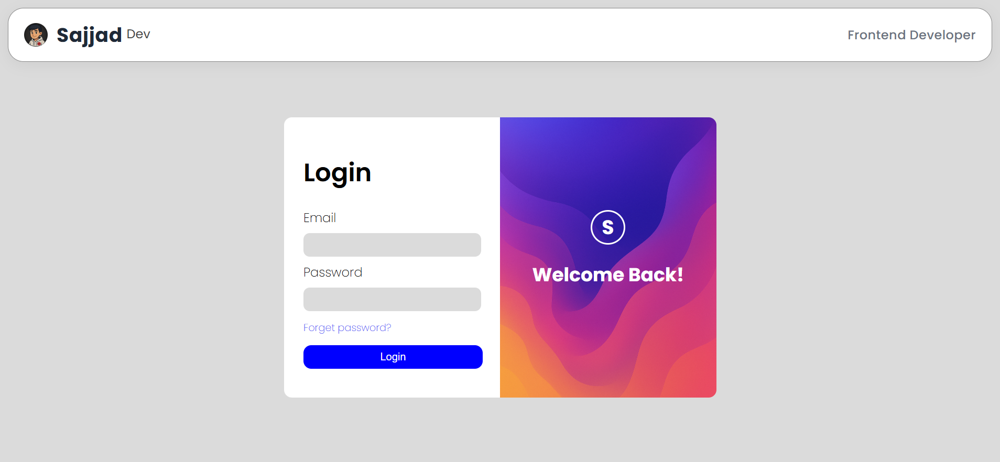

# 🔐 Modern Login Page

A clean and responsive Login Page built with pure HTML & CSS,  
focused on layout, design, and mobile-first responsiveness — without using JavaScript yet.

---

## 🚀 Features

- Fully responsive design (Grid + Flexbox)
- Minimal and modern UI
- Gradient “Welcome Back” header
- Clean form styling with soft shadows
- Mobile-first layout structure
- Fast and lightweight (no frameworks)

---

## 💡 Technologies Used

- HTML5 semantic structure
- CSS3 (Grid, Flexbox, pseudo-elements, modern units)
- _JavaScript not used yet — will be added later_

---

## 🎧 Developer Note

This project was built to practice responsive layouts, CSS Grid,  
and improving UI design without relying on frameworks.

JavaScript validation and interactions will be added once I complete  
DOM and event handling lessons 💪

---

## 🖼️ Preview

---

## 🧠 Key Concepts Practiced

- Building two-column layouts using CSS Grid
- Converting desktop layout to single-column mobile UI
- Using Flexbox for alignment and spacing
- Creating a gradient header section
- Improving visual hierarchy with padding & typography
- Building modern UI without any frameworks
- Practicing mobile-first structure
- Writing cleaner and more organized CSS

---

## 🔧 How to Run

1. Clone this repository:
   `bash
   git clone https://github.com/SajjadR17/modern-login-signup-page.git

---

## 🧾 License

This project is licensed under the MIT License — meaning you're free to use, modify, and share it,  
as long as you give proper credit to Sajjad Roohandeh.
